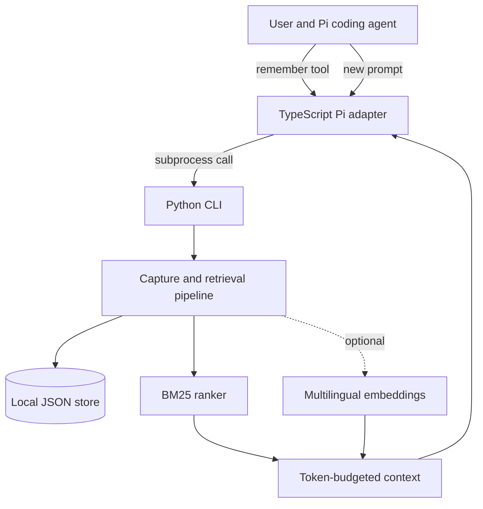

# Pi Agent Memory

Local, persistent memory for coding agents, with deterministic BM25 retrieval
and an optional multilingual semantic search layer.

[](https://github.com/how1215/Pi-Agent-Memory/actions/workflows/ci.yml)
[](https://www.python.org/)

Pi Agent Memory gives a local coding agent a small long-term memory outside its
conversation window. Durable project conventions and user preferences are saved
to disk, retrieved when they become relevant, and injected before the next agent
run. The default path has no service dependency and uses only Python's standard
library.

## Why this project matters

Coding agents usually lose project-specific knowledge when a session ends. This
project implements the complete memory lifecycle—**capture, store, retrieve, and
inject**—while keeping the critical path inspectable and failure-tolerant.

Key engineering outcomes:

- Persistent, human-readable JSON storage with SHA-256 deduplication and atomic writes
- Deterministic BM25 ranking with lightweight English, numeric, and CJK tokenization
- Optional hybrid ranking with local multilingual sentence embeddings
- Token-budgeted prompt construction to control context usage
- A subprocess boundary that lets the TypeScript Pi extension use the Python engine
- Repeatable evaluation over 130 memories and 61 labeled queries
- Automated tests across Python 3.10–3.13 in GitHub Actions

## Measured retrieval quality

The repository includes compact and extended labeled datasets. The larger set
adds same-topic distractors, vocabulary mismatch, and multilingual examples.

| Dataset | Retriever | Recall@5 | MRR | nDCG@5 |
| --- | --- | ---: | ---: | ---: |
| 30 memories / 21 queries | BM25 | 0.810 | 0.810 | 0.802 |
| 30 memories / 21 queries | Hybrid, α=0.3 | **1.000** | **0.914** | **0.936** |
| 100 memories / 40 queries | BM25 | 0.838 | 0.826 | 0.795 |
| 100 memories / 40 queries | Hybrid, α=0.3 | **0.938** | **0.943** | **0.910** |

These are reproducible offline measurements, not production traffic results.
See the [engineering case study](docs/engineering-case-study.md) for the
methodology, error analysis, and trade-offs.

## Architecture



The Pi adapter deliberately treats memory as an enhancement, not a hard
dependency. If the Python subprocess fails, the agent starts without injected
memory instead of blocking the user's work.

## Quick start

The core package requires Python 3.10 or newer and has no runtime dependencies.

```bash
git clone https://github.com/how1215/Pi-Agent-Memory.git
cd Pi-Agent-Memory
python -m venv .venv
source .venv/bin/activate
python -m pip install -e ".[test]"
pytest
```

Use the installed CLI directly:

```bash
export PI_MEMORY_PATH="$PWD/.pi-memory.json"

pi-memory capture \
  --summary "Use pnpm for this repository" \
  --tags "tooling,package-manager"

pi-memory retrieve --query "Which package manager should I use?" --k 3
pi-memory inject --query "How should I install dependencies?" --budget 500
```

Without an editable install, the same commands are available through
`python -m memory.cli` from the repository root.

## Retrieval modes

### Deterministic BM25

BM25 is the default because it is fast, transparent, reproducible, and has no
model dependency. It is well suited to exact technical terms such as command
names, file paths, and library names.

### Hybrid semantic search

Lexical matching cannot connect terms such as “package manager” and “pnpm,” or
match equivalent facts written in different languages. Install the optional
embedding dependency and enable hybrid mode to combine normalized BM25 and
cosine similarity:

```bash
python -m pip install -e ".[hybrid,test]"
PI_MEMORY_HYBRID=1 pi-memory retrieve \
  --query "Which package manager should I use?" --k 3
```

The scoring function is:

```text
score = α × normalized_bm25 + (1 − α) × cosine_similarity
```

The default `α=0.3` was selected through a small parameter sweep. Override it
with `PI_MEMORY_HYBRID_ALPHA`; values must be between 0 and 1. The embedding
model defaults to `sentence-transformers/paraphrase-multilingual-MiniLM-L12-v2`
and can be changed with `PI_MEMORY_EMBED_MODEL`.

## Pi integration

Install [Pi](https://github.com/earendil-works/pi) and configure a compatible local model provider. The included
[`models.json.example`](models.json.example) shows the expected provider shape.

```bash
npm install -g --ignore-scripts @earendil-works/pi-coding-agent
mkdir -p ~/.pi/agent
cp models.json.example ~/.pi/agent/models.json

pi -e "$PWD/pi-bridge/extension.ts"
```

The adapter resolves the repository path from its own location, so it works even
when Pi is launched from another directory. Set `PYTHON=/path/to/python` if Pi
should use a specific interpreter.

During a session, the agent can call `remember` for durable conventions. Before
future runs, `before_agent_start` retrieves related observations and supplies a
bounded block titled `Relevant memories from previous sessions`.

## Benchmarking

```bash
# Compact lexical baseline
python benchmark/run_benchmark.py --k 5 --per-query

# Extended dataset
python benchmark/run_benchmark.py \
  --corpus corpus_large.jsonl \
  --queries queries_large.jsonl \
  --k 5

# Hybrid evaluation; requires the optional dependency
PI_MEMORY_HYBRID=1 python benchmark/run_benchmark.py --k 5

# JSON output for experiment tracking
python benchmark/run_benchmark.py --json
```

The runner uses a temporary store, reports Recall@k, MRR, and nDCG@k, and never
touches the user's real memory file. Dataset details are documented in
[`benchmark/README.md`](benchmark/README.md).

## Configuration

| Environment variable | Default | Purpose |
| --- | --- | --- |
| `PI_MEMORY_PATH` | `~/.pi-memory.json` | Persistent observation file |
| `PI_MEMORY_HYBRID` | unset | Set to `1` to enable hybrid retrieval |
| `PI_MEMORY_HYBRID_ALPHA` | `0.3` | BM25 weight in the hybrid score |
| `PI_MEMORY_EMBED_MODEL` | multilingual MiniLM | Sentence-transformers model ID |
| `PYTHON` | `python3` | Interpreter used by the Pi adapter |

## Repository map

```text
memory/                     Python package
├── bm25.py                 deterministic lexical ranker
├── store.py                atomic JSON persistence and deduplication
├── hybrid.py               optional semantic + lexical ranker
├── core.py                 capture, retrieve, and inject orchestration
└── cli.py                  command-line interface
pi-bridge/extension.ts      Pi lifecycle and tool adapter
benchmark/                  labeled datasets and evaluation runner
tests/                      unit and integration tests
demo/                       end-to-end demonstration notes
docs/engineering-case-study.md
                            design rationale and retrieval analysis
```

## Current scope

This is a focused local-first prototype rather than a hosted memory platform.
It intentionally favors auditability over scale: one process writes a single
JSON file, approximate token counting avoids tokenizer dependencies, and there
is no automatic retention or sensitive-data classification. The case study
describes how those boundaries could evolve for concurrent or production use.
